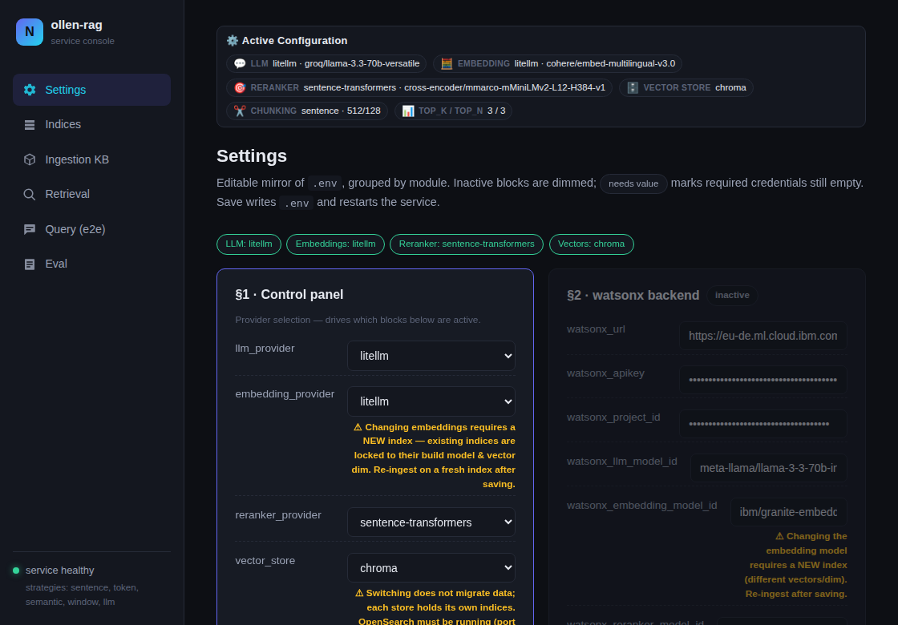
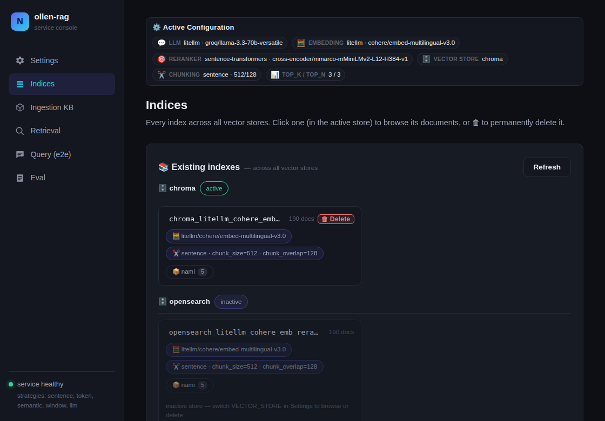
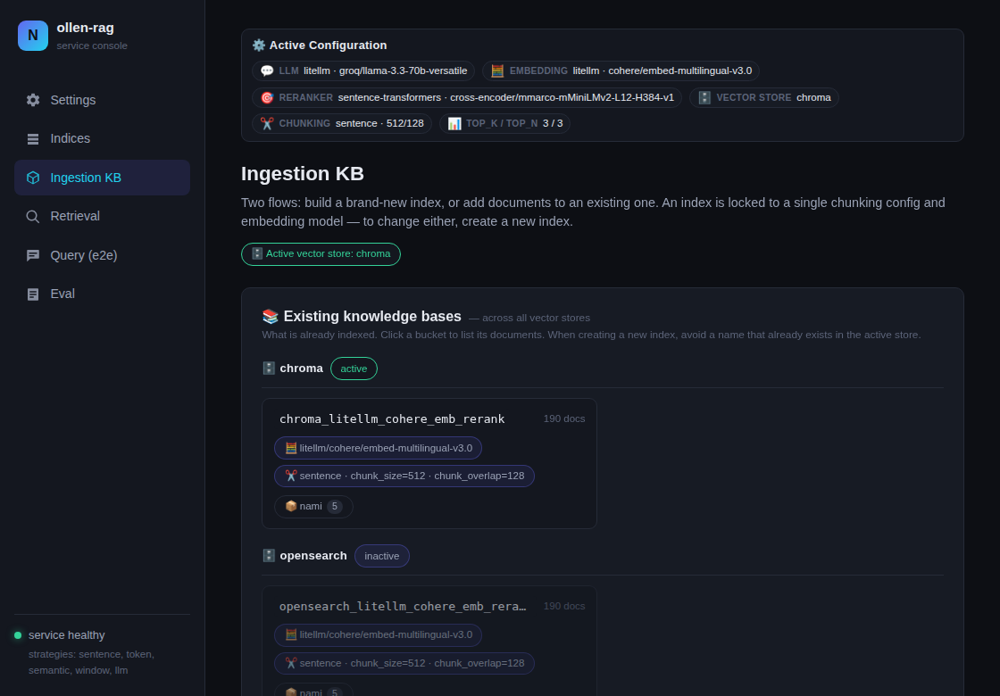
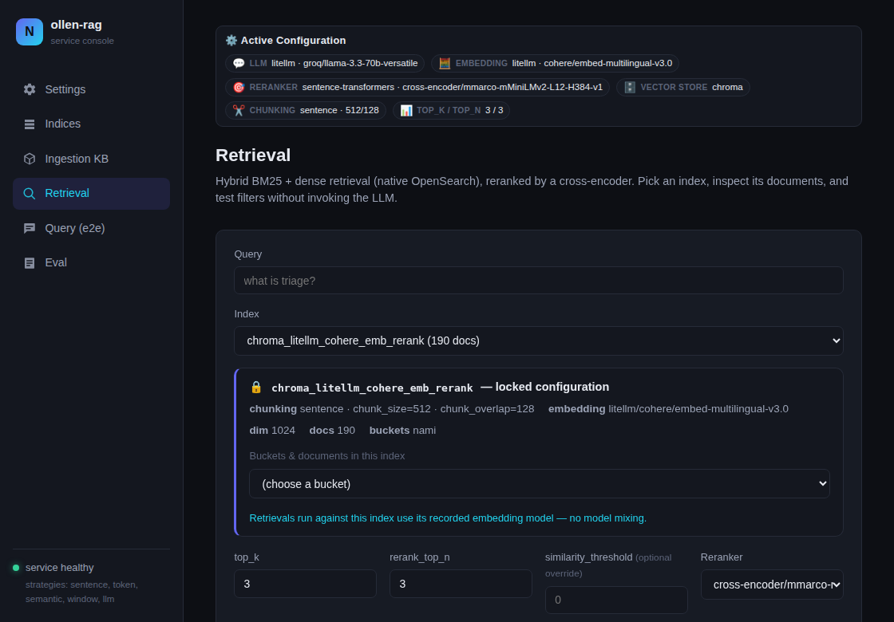
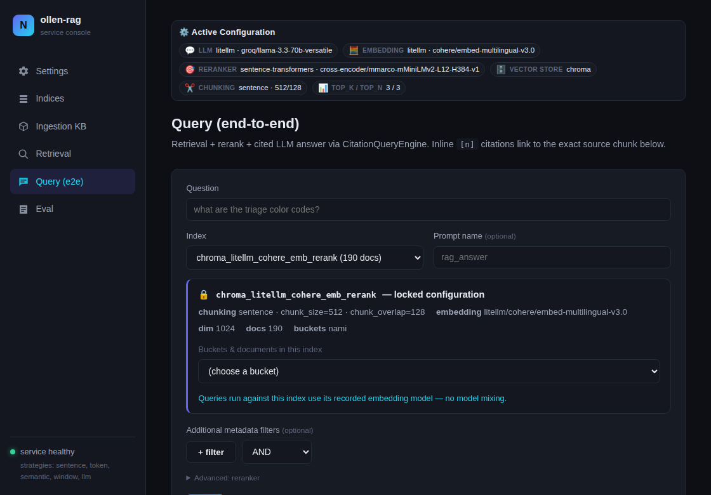
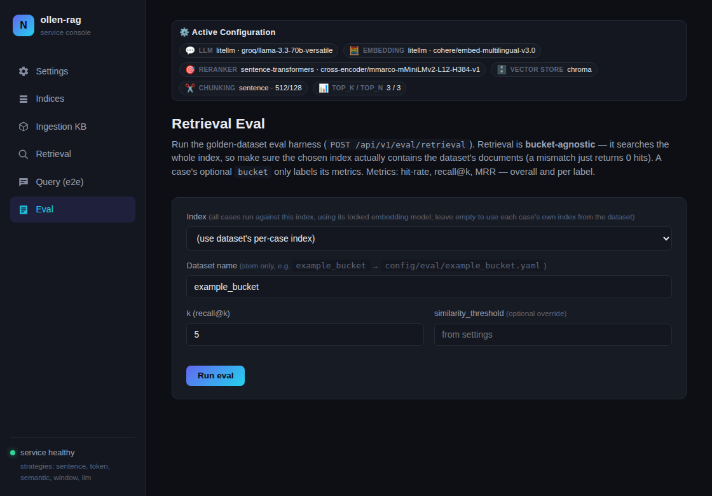

# ollen-rag-service

A provider-agnostic RAG (Retrieval-Augmented Generation) microservice. It ingests documents (PDF, Office, images) into a pluggable vector store, retrieves relevant chunks with hybrid search, and generates cited answers with an LLM. Every capability is exposed as both a **REST API** and **MCP tools**, so the service fits human-facing apps and AI agents alike.

- **Pluggable everything** — LLM, embeddings, reranker, and vector store are each selected independently by env var (watsonx.ai native, local fastembed/cross-encoder, or any LiteLLM vendor).
- **Three vector stores** — OpenSearch (dense + sparse + hybrid), Chroma (embedded, dense-only), and Qdrant (dense).
- **Cited answers** — numbered `[n]` citations mapped back to source chunks.
- **Web console** — a single-page UI mirrors the API for humans.

## Architecture

The repo is split into `backend/` (FastAPI / RAG) and `frontend/` (React console). A FastAPI
application (`backend/app.py`) with a FastMCP server mounted at `/mcp`, organized around the three
RAG phases:

1. **Ingestion** (`backend/src/rag/ingestion.py`) — documents are parsed with `liteparse` (LibreOffice/ImageMagick cover Office and image formats), chunked by a configurable strategy, embedded, and written to the active vector store. Each strategy writes to its own index (named after the strategy by default). REST ingestion runs as an async background job.
2. **Retrieval** (`backend/src/rag/retrieval.py`) — hybrid search (BM25 + dense vectors) with optional metadata filters, followed by reranking. Reranked scores are normalized to 0–1 relevance probabilities inside each connector, so providers are swappable without rescaling anything downstream.
3. **Generation** (`backend/src/rag/generation.py`) — reranked chunks are passed to the LLM with a YAML prompt template (`backend/config/prompts/`); the answer carries numbered `[n]` citations mapping to `sources[]`.

Each phase picks its provider independently — e.g. watsonx generation with local Ollama embeddings and a local cross-encoder reranker.

### Provider registry

Everything pluggable follows one decorator-registry pattern: a factory in `backend/src/factories/` defines the interface, concrete providers in `backend/src/providers/<capability>/` self-register on import. Providers are grouped by capability:

| Capability | Factory | Providers |
|------------|---------|-----------|
| LLM | `LLMConnectorFactory` | `watsonx`, `litellm`, `litellm-watsonx`, `litellm-ollama`, `litellm-openai`, `litellm-openrouter` |
| Embeddings | `EmbeddingFactory` | `watsonx`, `fastembed`, `litellm`, `litellm-watsonx`, `litellm-ollama`, `litellm-openai`, `litellm-openrouter` |
| Reranker | `RerankerFactory` | `sentence-transformers`, `litellm`, `litellm-watsonx` |
| Vector store | `VectorStoreFactory` | `opensearch`, `chroma`, `qdrant` |

The `VectorStoreBackend` interface (`src/factories/vector_store.py`) is the parity contract: every method is `@abstractmethod`, so a new backend must implement the full surface (retrieval, index/bucket admin, dedup, lifecycle) before it can instantiate. Backends declare their `supported_query_modes`; an unsupported mode falls back to the richest one available (a dense-only store degrades hybrid to dense).

**Adding a provider:** drop one file in the matching `backend/src/providers/<capability>/` folder with a `@register("name", model_field="...")` decorator, add one import line to that folder's `__init__.py`, then select it via the relevant `OLLEN_RAG_*_PROVIDER` / `OLLEN_RAG_VECTOR_STORE` env var. Embedding and reranker providers also need an entry in `backend/config/{embedding,reranker}_models.yaml` (an empty list there means "any model string").

## Setup

Requires [uv](https://docs.astral.sh/uv/) (`curl -LsSf https://astral.sh/uv/install.sh | sh`).

```bash
cd backend
uv sync                 # creates .venv and installs runtime + dev deps from uv.lock
cd ..
cp .env.example .env    # then fill in credentials
```

## Run

Both ways of running the service below share the same code, the same first-run wizard, and the
same config contract: `OLLEN_RAG_LLM_PROVIDER` and `OLLEN_RAG_EMBEDDING_PROVIDER` default to empty
— no vendor is chosen until you pick one, whether that's through the wizard at `/ui/` or, for
headless/CI/production runs that never touch a browser, by setting those two env vars (plus their
credentials) directly. `GET /ready` reflects that state (`503` until both are set); `GET /health`
stays `200` the whole time, since the process itself is fine and just waiting on setup.

### Docker (turnkey — recommended for a first look)

```bash
docker compose pull   # fetch the published CPU image instead of building it (seconds, not ~15-20min)
docker compose up
```

Brings up the service + a bundled Ollama + on-disk Chroma — **no API keys required to build**. Open
`http://localhost:8000/ui/`; a first-run wizard walks you through picking a provider and (for cloud
providers) entering credentials, testing them, and saving. Config persists on a volume; saving
applies immediately (no container restart) regardless of how the image is run. Add OpenSearch with
`docker compose --profile opensearch up -d` — if you pick it in the wizard/Settings before that,
the console warns. Same pattern for Qdrant: `docker compose --profile qdrant up -d`.
the console tells you and shows the exact command.

The `ollen-rag` image is published to `ghcr.io/enricollen/ollen-rag` on every push to `main`/`develop`
(`:latest`/`:develop`, amd64 only) and on version tags (`:v1.2.3`, amd64+arm64) — see
`.github/workflows/docker-publish.yml`. Pin a specific release instead of tracking `latest` with
`OLLEN_RAG_IMAGE_TAG=v1.2.3 docker compose pull`. If you'd rather build it yourself (e.g. to change
`TORCH_FLAVOR`, or before the first image has published), `docker compose up --build` still works
exactly as before — `pull` is purely an optional shortcut.

The image ships a **CPU-only** torch build by default (keeps it ~5–6 GB smaller). For GPU inference
of the local cross-encoder reranker, build with the CUDA wheel and expose the GPU:

```bash
TORCH_FLAVOR=gpu docker compose up --build   # needs the NVIDIA Container Toolkit + the deploy block in compose
```

The wizard shows the detected compute (CPU/GPU) read-only — the flavor is fixed at build time, not
switchable at runtime.

### Plain Python service

```bash
cp .env.example .env
cd backend && uv sync && ln -sfn ../.env .env
cd ../frontend && npm install && npm run build        # one-time: builds the console into frontend/dist
cd ../backend && uv run uvicorn app:app --reload
```

The same wizard runs here too (visit `/ui/` before configuring). Saving settings applies live —
`get_settings()` is re-read on the very next request, no restart needed in any of these run modes
(`--reload` additionally respawns the worker, purely for a clean dev slate). Point `OLLEN_RAG_*` at
your own OpenSearch/Ollama/cloud as needed.

The console (`frontend/`) is a Vite + React + TypeScript app that builds to static assets served by
FastAPI at `/ui/` — the build step above only needs to be re-run when you change `frontend/` itself,
not on every backend restart. For frontend development with hot reload instead, run `npm run dev`
inside `frontend/` (proxies `/api`, `/health`, `/ready` to `http://localhost:8000`, so run the
backend alongside it).

Ports: service `8000`, Ollama `11434`, and (with the `opensearch` profile) OpenSearch `9200`,
Dashboards `5601`. The first Docker build is slow because of the LibreOffice layer and the baked-in
local models.

## Web console

A single-page console is served at `http://localhost:8000/ui/`. An **Active Configuration** banner (effective providers, embedding model, chunking, top-k) sits atop every page; the sidebar walks the RAG phases.

| Settings — editable `.env` mirror | Indices — across all vector stores |
| :---: | :---: |
|  |  |
| **Ingestion KB — build or extend an index** | **Retrieval — hybrid search + rerank, no LLM** |
|  |  |
| **Query (e2e) — cited RAG answer** | **Eval — golden-dataset retrieval metrics** |
|  |  |

## REST API

| Method | Path | Description |
|--------|------|-------------|
| GET | `/health` | Liveness probe — 200 once the process is up, regardless of setup state |
| GET | `/ready` | Readiness probe — 200 once an LLM + embedding provider are configured, 503 otherwise |
| GET | `/api/v1/strategies` | List available chunking strategies |
| POST | `/api/v1/ingest` | Upload a document, start an async ingestion job (returns `job_id`, HTTP 202) |
| GET | `/api/v1/ingest/{job_id}` | Poll ingestion job status/result |
| POST | `/api/v1/retrieve` | Hybrid retrieval + rerank; returns scored chunks plus the BM25/dense/hybrid legs |
| POST | `/api/v1/query` | Full RAG: retrieval + rerank + cited LLM answer |
| POST | `/api/v1/eval/retrieval` | Score a golden dataset (hit-rate/recall@k/MRR) |
| GET | `/api/v1/config` | Effective non-secret settings |
| GET | `/api/v1/indices` | Service-owned indices with doc counts (active store) |
| GET | `/api/v1/indices/overview` | Every index across **all** registered stores, tagged active/inactive with build config + bucket→files map |
| GET | `/api/v1/indices/{name}/documents` | Paginate stored chunks (content + metadata), optionally scoped to a `bucket` |
| GET | `/api/v1/indices/{name}/info` | Full recorded build config: embedding, chunking, dim, doc count, buckets |
| GET | `/api/v1/indices/{name}/embedding` | Embedding provider/model the index was built with |
| GET | `/api/v1/indices/{name}/buckets` | Distinct `bucket` values in an index |
| DELETE | `/api/v1/indices/{name}` | Permanently delete an index and all its documents |
| DELETE | `/api/v1/indices/{name}/buckets/{bucket}` | Permanently delete one bucket; returns deleted count. Idempotent |

### Ingest a document

```bash
curl -X POST http://localhost:8000/api/v1/ingest \
  -F "file=@./mydoc.pdf" \
  -F "strategy=sentence" \
  -F 'metadata={"project": "acme", "lang": "it"}'
# -> {"job_id": "…", "status": "pending"}

curl http://localhost:8000/api/v1/ingest/<job_id>   # poll
```

Job polling returns live `progress` (0–100) and `stage` (`parsing → chunking → enriching → storing → done`). The KB panel accepts multiple files per submit and processes them strictly one at a time, so heavy LLM ingests never run concurrently; a failed file is reported and the batch continues.

**Deduplication** is by content hash: each chunk stores a `file_hash` (sha256 of the bytes), and ingestion is skipped when the same hash already exists in the target index **within the same bucket**. A skipped job completes with `"skipped_duplicate": true` and `"duplicate_of": "<file_name>"`.

### Retrieve chunks

```bash
curl -X POST http://localhost:8000/api/v1/retrieve \
  -H "Content-Type: application/json" \
  -d '{
    "query": "How do I reset my password?",
    "strategy": "sentence",
    "top_k": 10,
    "rerank_top_n": 4,
    "filters": [{"key": "project", "value": "acme", "operator": "=="}],
    "filter_condition": "and"
  }'
```

### Ask a question

```bash
curl -X POST http://localhost:8000/api/v1/query \
  -H "Content-Type: application/json" \
  -d '{"query": "How do I reset my password?", "strategy": "sentence"}'
# -> {"answer": "… [1] …", "sources": [{"id": 1, "text": "…", "metadata": {…}}, …]}
```

### LLM keyword enrichment (opt-in)

Set `enrich_keywords=true` (ingest form, `OLLEN_RAG_ENRICH_KEYWORDS=true`, or the MCP param) to run one LLM call per chunk at ingest time, extracting 5–10 keywords into `metadata.keywords`. Keywords are embedded with the chunk (better dense recall) and searched by BM25 via `multi_match` on `content` + `metadata.keywords^2` (better lexical recall). Slower ingestion; already-indexed chunks are not backfilled. Measure the impact with the eval harness before/after enabling it.

### Managing indices and buckets

The **Indices** page lists every index across all registered stores. Indices in the active store are browsable and deletable; inactive-store ones are read-only. Two irreversible, confirmation-gated deletes: a whole index (`DELETE /api/v1/indices/{name}`) or a single bucket (`DELETE /api/v1/indices/{name}/buckets/{bucket}`, idempotent). Both work identically on OpenSearch and Chroma.

## Retrieval evaluation

Golden datasets live in `backend/config/eval/*.yaml` (see `backend/config/eval/example.yaml`; each case is scoped to a mandatory `bucket`). Metrics: hit-rate@k, recall@k, MRR — overall and per bucket.

```bash
# CLI
cd backend && python -m src.rag.evaluation --dataset config/eval/golden.yaml [--top-k 10 --threshold 0.2 --no-rerank]

# API
curl -X POST http://localhost:8000/api/v1/eval/retrieval -d '{"dataset": "golden"}'
```

Run it before and after changing hybrid weights, `similarity_threshold`, chunking strategy, or the reranker — retrieval tuning without a baseline is guesswork.

## MCP server

The FastMCP server is mounted at `http://localhost:8000/mcp` (streamable HTTP transport), exposing four tools that delegate to the same RAG layer as the REST API:

| Tool | Purpose |
|------|---------|
| `ingest_document` | Parse/chunk/embed/store a **server-local** file path |
| `retrieve` | Hybrid BM25 + dense retrieval + rerank |
| `rag_query` | Cited RAG answer |
| `list_indices` | Service-owned indices with doc counts |

```json
{
  "mcpServers": {
    "ollen-rag": { "type": "http", "url": "http://localhost:8000/mcp" }
  }
}
```

## Chunking strategies

Each strategy stores its chunks in a dedicated index named after the strategy, so one corpus can be indexed and compared under multiple strategies. Pass an explicit `index_name` to override (e.g. to name an index by embedding model or corpus). **One index = one build config:** an index's `_meta` records its embedding provider/model and chunking config, and ingestion rejects any document whose embedding or chunking differs from what the index was built with.

| Strategy | Splitter | Notes |
|----------|----------|-------|
| `sentence` | SentenceSplitter | Default; sentence-aware, `chunk_size`/`chunk_overlap` |
| `token` | TokenTextSplitter | Fixed token windows |
| `semantic` | SemanticSplitterNodeParser | Embedding-based topic breakpoints |
| `window` | SentenceWindowNodeParser | One sentence per chunk plus a ±`sentence_window_size` context window |
| `llm` | LLM-driven topic splitter | LLM groups sentences into topics; slowest |

## Configuration

All settings live in `src/settings.py`, overridable via `OLLEN_RAG_*` environment variables (a local `.env` is honored; see `.env.example`).

| Variable | Default | Description |
|----------|---------|-------------|
| `OLLEN_RAG_WATSONX_URL` | `https://eu-de.ml.cloud.ibm.com` | watsonx.ai endpoint |
| `OLLEN_RAG_WATSONX_APIKEY` | (empty) | watsonx.ai API key |
| `OLLEN_RAG_WATSONX_PROJECT_ID` | (empty) | watsonx.ai project id |
| `OLLEN_RAG_WATSONX_LLM_MODEL_ID` | `meta-llama/llama-3-3-70b-instruct` | LLM model id |
| `OLLEN_RAG_WATSONX_EMBEDDING_MODEL_ID` | `ibm/slate-125m-english-rtrvr` | Embedding model id |
| `OLLEN_RAG_WATSONX_MAX_NEW_TOKENS` | `800` | Max generated tokens |
| `OLLEN_RAG_WATSONX_TEMPERATURE` | `0.1` | LLM temperature |
| `OLLEN_RAG_WATSONX_REPETITION_PENALTY` | `1.15` | Penalizes repeated tokens; >1.3 garbles output |
| `OLLEN_RAG_EMBEDDING_PROVIDER` | `watsonx` | `watsonx`, `fastembed`, `litellm`, `litellm-watsonx`, `litellm-ollama`, `litellm-openai`, `litellm-openrouter` |
| `OLLEN_RAG_LLM_PROVIDER` | `watsonx` | `watsonx`, `litellm`, `litellm-watsonx`, `litellm-ollama`, `litellm-openai`, `litellm-openrouter` |
| `OLLEN_RAG_RERANKER_PROVIDER` | `sentence-transformers` | `sentence-transformers`, `litellm`, `litellm-watsonx` (Ollama has no rerank endpoint) |
| `OLLEN_RAG_LITELLM_MODEL` | (empty) | LiteLLM model string for the generic LLM provider, e.g. `openai/gpt-4o` |
| `OLLEN_RAG_LITELLM_API_BASE` | (empty) | Endpoint override; shared fallback for the two below |
| `OLLEN_RAG_LITELLM_API_KEY` | (empty) | API key; shared fallback for the two below |
| `OLLEN_RAG_LITELLM_MAX_NEW_TOKENS` | `800` | Generation cap for `litellm` and `litellm-ollama` |
| `OLLEN_RAG_LITELLM_TEMPERATURE` | `0.1` | Sampling temperature for `litellm` and `litellm-ollama` |
| `OLLEN_RAG_LITELLM_EMBEDDING_MODEL` | (empty) | LiteLLM model string for the generic embedding provider |
| `OLLEN_RAG_LITELLM_EMBEDDING_API_BASE` | (empty) | Embedding endpoint; falls back to `OLLEN_RAG_LITELLM_API_BASE` |
| `OLLEN_RAG_LITELLM_EMBEDDING_API_KEY` | (empty) | Embedding key; falls back to `OLLEN_RAG_LITELLM_API_KEY` |
| `OLLEN_RAG_LITELLM_RERANK_MODEL` | (empty) | LiteLLM model string for the generic rerank provider, e.g. `cohere/rerank-v3.5` |
| `OLLEN_RAG_LITELLM_RERANK_API_BASE` | (empty) | Rerank endpoint; falls back to `OLLEN_RAG_LITELLM_API_BASE` |
| `OLLEN_RAG_LITELLM_RERANK_API_KEY` | (empty) | Rerank key; falls back to `OLLEN_RAG_LITELLM_API_KEY` |
| `OLLEN_RAG_OPENAI_MODEL` | (empty) | Bare model name for `litellm-openai`; `openai/` prefix added by connector |
| `OLLEN_RAG_OPENAI_API_KEY` | (empty) | API key for OpenAI or compatible server |
| `OLLEN_RAG_OPENAI_API_BASE` | (empty) | Endpoint override; empty = official OpenAI endpoint |
| `OLLEN_RAG_OPENAI_MAX_NEW_TOKENS` | `800` | Generation cap for `litellm-openai` |
| `OLLEN_RAG_OPENAI_TEMPERATURE` | `0.1` | Sampling temperature for `litellm-openai` |
| `OLLEN_RAG_OPENAI_EMBEDDING_MODEL` | (empty) | Bare embedding model name for `litellm-openai` |
| `OLLEN_RAG_OPENROUTER_MODEL` | (empty) | Bare `<vendor>/<model>` tag for `litellm-openrouter`, e.g. `google/gemini-2.5-flash`; `openrouter/` prefix added by connector |
| `OLLEN_RAG_OPENROUTER_API_KEY` | (empty) | OpenRouter API key |
| `OLLEN_RAG_OPENROUTER_API_BASE` | (empty) | Endpoint override; empty = OpenRouter's own endpoint |
| `OLLEN_RAG_OPENROUTER_MAX_NEW_TOKENS` | `800` | Generation cap for `litellm-openrouter` |
| `OLLEN_RAG_OPENROUTER_TEMPERATURE` | `0.1` | Sampling temperature for `litellm-openrouter` |
| `OLLEN_RAG_OPENROUTER_EMBEDDING_MODEL` | (empty) | Bare `<vendor>/<model>` embedding tag for `litellm-openrouter`; OpenRouter's embedding catalog is scarce |
| `OLLEN_RAG_OLLAMA_API_BASE` | `http://localhost:11434` | Local Ollama endpoint |
| `OLLEN_RAG_OLLAMA_MODEL` | `llama3.1` | Bare Ollama chat model tag (connector adds `ollama/`) |
| `OLLEN_RAG_OLLAMA_EMBEDDING_MODEL` | `nomic-embed-text` | Bare Ollama embedding model tag |
| `OLLEN_RAG_FASTEMBED_MODEL_NAME` | `BAAI/bge-small-en-v1.5` | fastembed model (local embeddings) |
| `OLLEN_RAG_VECTOR_STORE` | `opensearch` | `opensearch` (dense+sparse+hybrid), `chroma` (embedded, dense-only), or `qdrant` (dense). Process-global |
| `OLLEN_RAG_CHROMA_PATH` | `./chroma_db` | On-disk location for the embedded Chroma store |
| `OLLEN_RAG_QDRANT_URL` | `http://localhost:6333` | Qdrant URL (compose profile `qdrant`) |
| `OLLEN_RAG_QDRANT_API_KEY` | (empty) | Optional Qdrant API key |
| `OLLEN_RAG_QDRANT_PATH` | (empty) | Embedded on-disk Qdrant path; when set, wins over URL |
| `OLLEN_RAG_OPENSEARCH_URL` | `http://localhost:9200` | OpenSearch URL |
| `OLLEN_RAG_OPENSEARCH_USER` | (empty) | OpenSearch basic-auth user |
| `OLLEN_RAG_OPENSEARCH_PASSWORD` | (empty) | OpenSearch basic-auth password |
| `OLLEN_RAG_OPENSEARCH_VERIFY_CERTS` | `true` | Verify TLS certificates |
| `OLLEN_RAG_OPENSEARCH_HYBRID_PIPELINE` | `ollen-rag-hybrid` | Hybrid search pipeline name |
| `OLLEN_RAG_HYBRID_SPARSE_WEIGHT` | `0.3` | BM25 weight in hybrid fusion |
| `OLLEN_RAG_HYBRID_DENSE_WEIGHT` | `0.7` | Dense weight in hybrid fusion |
| `OLLEN_RAG_DEFAULT_CHUNKING_STRATEGY` | `sentence` | `sentence` \| `token` \| `semantic` \| `window` \| `llm` |
| `OLLEN_RAG_CHUNK_SIZE` | `512` | Chunk size (sentence/token) |
| `OLLEN_RAG_CHUNK_OVERLAP` | `64` | Chunk overlap (sentence/token) |
| `OLLEN_RAG_SEMANTIC_BREAKPOINT_PERCENTILE` | `95` | Semantic split threshold |
| `OLLEN_RAG_SENTENCE_WINDOW_SIZE` | `3` | Window size for `window` strategy |
| `OLLEN_RAG_RETRIEVAL_TOP_K` | `10` | Candidates fetched from the store |
| `OLLEN_RAG_RERANK_TOP_N` | `4` | Chunks kept after reranking |
| `OLLEN_RAG_RERANKER_MODEL` | `cross-encoder/mmarco-mMiniLMv2-L12-H384-v1` | Local cross-encoder (`sentence-transformers`) |
| `OLLEN_RAG_WATSONX_RERANKER_MODEL_ID` | `cross-encoder/ms-marco-minilm-l-12-v2` | Bare model id for `litellm-watsonx` rerank |
| `OLLEN_RAG_CITATION_CHUNK_SIZE` | `512` | Citation chunk size for generation |
| `OLLEN_RAG_PROMPTS_DIR` | `config/prompts` | Prompt templates directory |
| `OLLEN_RAG_DEFAULT_PROMPT_NAME` | `rag_answer_en` | Default prompt template (`rag_answer_en` English, `rag_answer_it` Italian) |
| `OLLEN_RAG_LOG_LEVEL` | `INFO` | `DEBUG` for per-chunk detail |

## Tests

```bash
# Unit tests (integration tests excluded by default — see [tool.pytest] in backend/pyproject.toml)
cd backend && uv run pytest

# Integration tests (require a running OpenSearch)
cd backend && uv run pytest -m integration
```

## Roadmap

- Add [Docling](https://github.com/docling-project/docling) as an additional parser option.
- Broaden file-type support (`.txt`, `.pptx`, `.docx`, …).